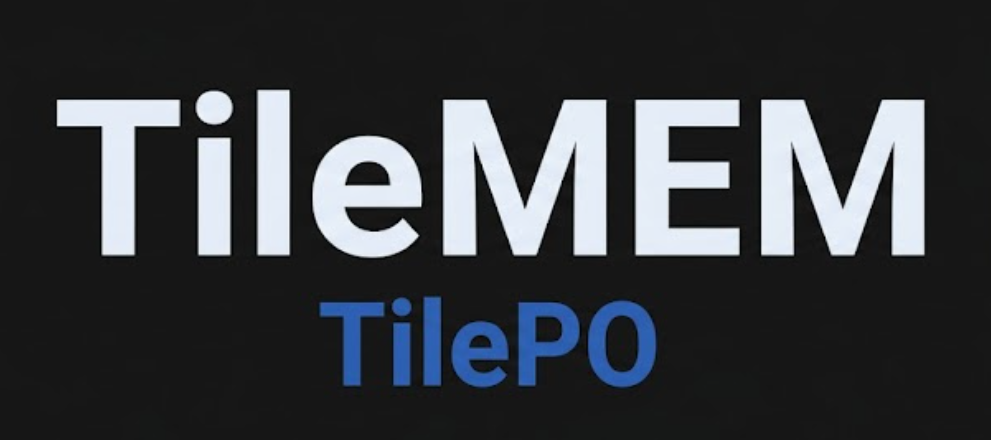
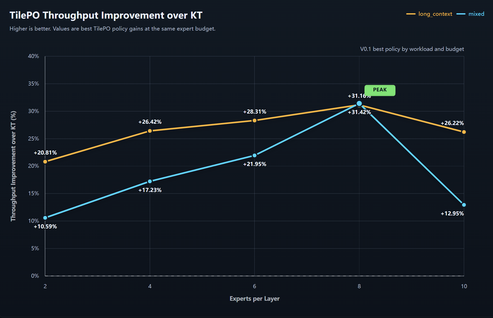
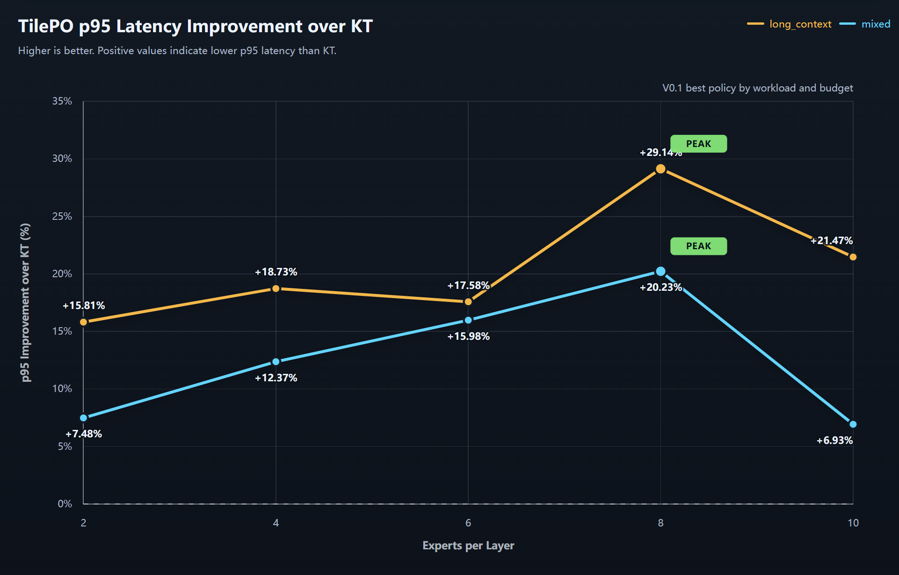

<p align="center">
  
</p>

# TileMEM / TilePO

TileMEM is an open MoE serving optimization project. TilePO, short for
Tile-level Placement Optimization, is its BF16 profile-guided tile-level
placement/admission system for high-throughput MoE serving.

This repository is the V0.1 priority artifact for TilePO. It contains the
method description, source code, V0.1 evidence, public manifests, reproducibility
scripts, and checksum tooling needed to make the result public, citable, and
verifiable.

## Technical Report

- PDF: [TileMEM / TilePO V0.1 Technical Report](paper/TileMEM_TilePO_V0_1_Technical_Report.pdf)
- Source: [paper/tilemem_tilepo_v0_1_technical_report.md](paper/tilemem_tilepo_v0_1_technical_report.md)
- Rebuild command: `python3 paper/build_tilemem_tilepo_report.py`

The report summarizes the TileMEM implementation architecture, the TilePO
VRAM/DRAM tile-placement motivation, V0.1 BF16 same-budget results, claim
boundaries, reproducibility path, and public priority record.

## Priority Record

TileMEM / TilePO keeps two public records: the original priority anchor and the
current PDF-included record. The original record preserves first public
disclosure. The current record adds the generated technical report PDF to the
archived artifact chain.

Original priority anchor, 2026-06-11:

- GitHub release: [v0.1-priority-2026-06-11](https://github.com/TerminusAkivili/TileMEM/releases/tag/v0.1-priority-2026-06-11)
- Zenodo DOI: [10.5281/zenodo.20646195](https://doi.org/10.5281/zenodo.20646195)
- Zenodo concept DOI: `10.5281/zenodo.20646194`
- Software Heritage SWHID: `swh:1:snp:073ee68e366c28f478e81db109056b68f9b146ab`
- Release tarball SHA256: `4592f09fb451c5d0fe998d9f4fb83ab774100ddba72dc580ef1c5772b7b70f3b`

Current PDF-included record, 2026-06-12:

- GitHub release: [v0.1.1-pdf-2026-06-12](https://github.com/TerminusAkivili/TileMEM/releases/tag/v0.1.1-pdf-2026-06-12)
- Zenodo DOI: [10.5281/zenodo.20648132](https://doi.org/10.5281/zenodo.20648132)
- Zenodo concept DOI: `10.5281/zenodo.20646194`
- Software Heritage SWHID: `swh:1:snp:1b8b452d7fc26b52c53ae79a2dcfed0e98984389`
- Git tag: `v0.1.1-pdf-2026-06-12`
- Git commit: `b864a2375e7f05ce41200a43c90c2016fd738590`
- PDF SHA256: `97aef412b58835eeed318aeb4a439aec4e87990252f92dfb0e2adac1cae770d7`
- Release package SHA256: `e48a32ddfa081a7ab4a327fa56044abd6eb8c0abba75666e5db8438ea91db5dc`

These records are backed by public GitHub releases, Zenodo archives, Software
Heritage snapshots, and SHA256 checksums.

## Citation

If you use TileMEM / TilePO, please cite the current PDF-included Zenodo
artifact:

```bibtex
@software{tilemem_tilepo_v0_1_2026,
  title   = {TileMEM TilePO v0.1: BF16 Profile-Guided Tile-Level Placement/Admission for MoE Serving},
  author  = {TerminusAkivili},
  year    = {2026},
  version = {v0.1.1-pdf-2026-06-12},
  doi     = {10.5281/zenodo.20648132},
  url     = {https://github.com/TerminusAkivili/TileMEM}
}
```

## What TilePO Claims

TilePO studies when MoE expert weights should be admitted, retained, or
organized at tile granularity under fixed GPU expert budgets. V0.1 evaluates
TilePO in a BF16 KT-native serving path and compares against KT expert-level
placement under the same expert budget.

Safe claim:

> To the best of the author's knowledge, TilePO is among the first open artifact
> systems to publicly disclose and evaluate BF16 profile-guided tile-level
> placement/admission for MoE serving under same expert-budget KT baselines.

Boundary:

- no full native CUDA MoE replacement claim;
- no FP8/MXFP4 serving-quality claim;
- no universal win claim across all models, GPUs, or serving systems;
- no claim that fine-grained tiles alone explain every win.

## V0.1 Headline Evidence

The strongest V0.1 evidence is the V0.1 ablation matrix:

```text
Workloads: mixed, long_context
Experts: 2, 4, 6, 8, 10
Policies: kt_expert, tilepo_coarse, tilepo_fine, tilepo_hybrid
Async planning: off, on
Repeats: 3
Request count: 5
Rows: 210 / 210 real success
Gate: PASS
Serving precision: BF16 / KT-native path
```

<p align="center">
  
</p>

<p align="center">
  
</p>

## TMAP Predictor

TMAP, short for Two-Tier Tile Memory Allocation Predictor, is an experimental
hardware-aware cost-model module for TileMEM. TMAP V0.1 reuses the public
TilePO V0.1 BF16 samples and predicts relative policy preference under a
two-tier VRAM/DRAM hardware profile.

TMAP is intentionally conservative:

- it predicts KT vs TilePO policy preference, not exact serving tok/s;
- it models the current two-tier VRAM/DRAM setting only;
- it uses BF16 V0.1 samples for calibration;
- it recommends fallback KT when predicted TilePO gain is below threshold.
- it can explicitly extrapolate unseen expert budgets, but those decisions are
  marked as quick-planning estimates and include a short probe recommendation.

Example:

```bash
tools/tmap_predict \
  --summary evidence/ablation/tilepo_ablation_summary.json \
  --hardware-profile TMAP/hardware_profiles/rtx5090_ddr.json \
  --out-dir build/tmap_rtx5090_ddr
```

Example quick-planning extrapolation for an unseen expert budget:

```bash
tools/tmap_predict \
  --summary evidence/ablation/tilepo_ablation_summary.json \
  --hardware-profile TMAP/hardware_profiles/rtx5090_ddr.json \
  --out-dir build/tmap_rtx5090_ddr_mixed12 \
  --target mixed:12 \
  --allow-extrapolation
```

Use `--target-experts 12` only when you intentionally want to scan that expert
budget for every measured workload.

See [TMAP/README.md](TMAP/README.md) and the checked-in reports under
[TMAP/reports](TMAP/reports).

## Quickstart: Offline Verification

This does not require a GPU or model checkpoint. It verifies the released V0.1
manifest and regenerates the V0.1 report from evidence files.

```bash
git clone https://github.com/TerminusAkivili/TileMEM.git
cd TileMEM
python3 -m pip install -e .
bash examples/quickstart_offline.sh
```

Expected outcome:

```text
TilePO V0.1 ablation gate: PASS
Rows: 210/210
Groups: 70
```

## Quickstart: Bring Your Own MoE Model

Real BF16 serving evaluation requires a compatible MoE checkpoint and the local
KT/SGLang runtime environment.

```bash
export TILEMEM_MODEL_PATH=/path/to/moe/checkpoint
export TILEMEM_PLAN=configs/models/olmoe_1b_7b_example.tmem
export TILEMEM_WORKLOAD=mixed
export TILEMEM_EXPERTS=2,4,6,8,10
export TILEMEM_OUT_DIR=build/custom_model_run

bash examples/quickstart_custom_model.sh
```

The public model interface is explicit:

- model path comes from `TILEMEM_MODEL_PATH` or `--model-path`;
- plan comes from a `.tmem` config;
- default precision is BF16;
- TilePO does not silently switch to FP8/MXFP4.

## Repository Layout

```text
TMAP/             Two-tier hardware-aware Tile Memory Allocation Predictor.
tilepo/            TilePO Python implementation.
tools/             Reporters, sweep runners, V0.1 plan renderers, tests.
configs/          Replaceable model, workload, and plan examples.
evidence/ablation/
                  V0.1 report, summary, and public manifest.
paper/            Technical report snapshot.
scripts/          Verification, packaging, and real-run wrappers.
examples/         User-facing quickstarts.
publish/          Generated release packet.
```

## Upstream Projects

TileMEM / TilePO uses several open-source systems projects:

- [KTransformers](https://github.com/kvcache-ai/ktransformers): used as the
  KT-native BF16 serving baseline and expert-placement path in the V0.1
  artifact.
- [SGLang](https://github.com/sgl-project/sglang): used as part of the serving
  shell and runtime integration context.
- [TileLang](https://github.com/tile-ai/tilelang): used as a tile-programming
  and research-lowering reference for TileMEM's tile-level planning direction.

We thank the maintainers and contributors of these projects for making open
infrastructure available to the systems research community.

## License

The V0.1 artifact is released under the MIT License. Review the license before
public release if a different open-source policy is required.
