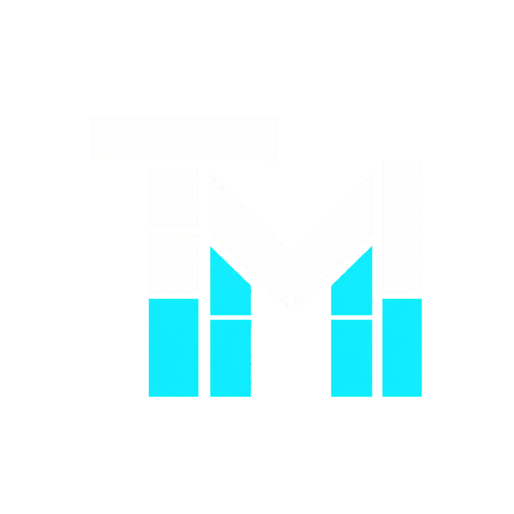

<p align="center">
  
</p>

# TileMEM / TilePO

TileMEM is an open MoE serving optimization project. TilePO, short for
Tile-level Placement Optimization, is its BF16 profile-guided tile-level
placement/admission system for high-throughput MoE serving.

This repository is the V0.1 priority artifact for TilePO. It contains the
method description, source code, V0.1 evidence, public manifests, reproducibility
scripts, and checksum tooling needed to make the result public, citable, and
verifiable.

## Technical Report

- PDF: [TileMEM / TilePO V0.1 Technical Report](paper/TileMEM_TilePO_V0_1_Technical_Report.pdf)
- Source: [paper/tilemem_tilepo_v0_1_technical_report.md](paper/tilemem_tilepo_v0_1_technical_report.md)
- Rebuild command: `python3 paper/build_tilemem_tilepo_report.py`

The report summarizes the TileMEM implementation architecture, the TilePO
VRAM/DRAM tile-placement motivation, V0.1 BF16 same-budget results, claim
boundaries, reproducibility path, and public priority record.

## Priority Record

TileMEM / TilePO keeps two public records: the original priority anchor and the
current PDF-included record. The original record preserves first public
disclosure. The current record adds the generated technical report PDF to the
archived artifact chain.

Original priority anchor, 2026-06-11:

- GitHub release: [v0.1-priority-2026-06-11](https://github.com/TerminusAkivili/TileMEM/releases/tag/v0.1-priority-2026-06-11)
- Zenodo DOI: [10.5281/zenodo.20646195](https://doi.org/10.5281/zenodo.20646195)
- Zenodo concept DOI: `10.5281/zenodo.20646194`
- Software Heritage SWHID: `swh:1:snp:073ee68e366c28f478e81db109056b68f9b146ab`
- Release tarball SHA256: `4592f09fb451c5d0fe998d9f4fb83ab774100ddba72dc580ef1c5772b7b70f3b`

Current PDF-included record, 2026-06-12:

- GitHub release: [v0.1.1-pdf-2026-06-12](https://github.com/TerminusAkivili/TileMEM/releases/tag/v0.1.1-pdf-2026-06-12)
- Zenodo DOI: [10.5281/zenodo.20648132](https://doi.org/10.5281/zenodo.20648132)
- Zenodo concept DOI: `10.5281/zenodo.20646194`
- Software Heritage SWHID: `swh:1:snp:1b8b452d7fc26b52c53ae79a2dcfed0e98984389`
- Git tag: `v0.1.1-pdf-2026-06-12`
- Git commit: `b864a2375e7f05ce41200a43c90c2016fd738590`
- PDF SHA256: `97aef412b58835eeed318aeb4a439aec4e87990252f92dfb0e2adac1cae770d7`
- Release package SHA256: `e48a32ddfa081a7ab4a327fa56044abd6eb8c0abba75666e5db8438ea91db5dc`

These records are backed by public GitHub releases, Zenodo archives, Software
Heritage snapshots, and SHA256 checksums.

## Citation

If you use TileMEM / TilePO, please cite the current PDF-included Zenodo
artifact:

```bibtex
@software{tilemem_tilepo_v0_1_2026,
  title   = {TileMEM TilePO v0.1: BF16 Profile-Guided Tile-Level Placement/Admission for MoE Serving},
  author  = {TerminusAkivili},
  year    = {2026},
  version = {v0.1.1-pdf-2026-06-12},
  doi     = {10.5281/zenodo.20648132},
  url     = {https://github.com/TerminusAkivili/TileMEM}
}
```

## What TilePO Claims

TilePO studies when MoE expert weights should be admitted, retained, or
organized at tile granularity under fixed GPU expert budgets. V0.1 evaluates
TilePO in a BF16 KT-native serving path and compares against KT expert-level
placement under the same expert budget.

Safe claim:

> To the best of the author's knowledge, TilePO is among the first open artifact
> systems to publicly disclose and evaluate BF16 profile-guided tile-level
> placement/admission for MoE serving under same expert-budget KT baselines.

Boundary:

- no full native CUDA MoE replacement claim;
- no FP8/MXFP4 serving-quality claim;
- no universal win claim across all models, GPUs, or serving systems;
- no claim that fine-grained tiles alone explain every win.

## V0.1 Headline Evidence

The strongest V0.1 evidence is the V0.1 ablation matrix:

```text
Workloads: mixed, long_context
Experts: 2, 4, 6, 8, 10
Policies: kt_expert, tilepo_coarse, tilepo_fine, tilepo_hybrid
Async planning: off, on
Repeats: 3
Request count: 5
Rows: 210 / 210 real success
Gate: PASS
Serving precision: BF16 / KT-native path
```

<p align="center">
  
</p>

<p align="center">
  
</p>

## TMAP Predictor

TMAP, short for Two-Tier Tile Memory Allocation Predictor, is an experimental
hardware-aware cost-model module for TileMEM. TMAP V0.1 reuses the public
TilePO V0.1 BF16 samples and predicts relative policy preference under a
two-tier VRAM/DRAM hardware profile.

TMAP is intentionally conservative:

- it predicts KT vs TilePO policy preference, not exact serving tok/s;
- it models the current two-tier VRAM/DRAM setting only;
- it uses BF16 V0.1 samples for calibration;
- it recommends fallback KT when predicted TilePO gain is below threshold.
- it can explicitly extrapolate unseen expert budgets, but those decisions are
  marked as quick-planning estimates and include a short probe recommendation.

Example:

```bash
tools/tmap_predict \
  --summary evidence/ablation/tilepo_ablation_summary.json \
  --hardware-profile TMAP/hardware_profiles/rtx5090_ddr.json \
  --out-dir build/tmap_rtx5090_ddr
```

Example quick-planning extrapolation for an unseen expert budget:

```bash
tools/tmap_predict \
  --summary evidence/ablation/tilepo_ablation_summary.json \
  --hardware-profile TMAP/hardware_profiles/rtx5090_ddr.json \
  --out-dir build/tmap_rtx5090_ddr_mixed12 \
  --target mixed:12 \
  --allow-extrapolation
```

Use `--target-experts 12` only when you intentionally want to scan that expert
budget for every measured workload.

See [TMAP/README.md](TMAP/README.md) and the checked-in reports under
[TMAP/reports](TMAP/reports).

## Industrial Python SDK

TileMEM exposes a compact Python facade for application and kernel integration:

```python
import tilemem as TM

spec = TM.model_spec(
    name="my_moe",
    layers=2,
    experts_per_layer=4,
    hidden_size=16,
    intermediate_size=32,
    expert_budget=2,
)
compiled = TM.plan(spec)
print(compiled.dispatch_summary(iterations=3))
print(TM.v0_1_headline_gain()["best"])
```

The SDK wraps the public model interface, HF checkpoint topology inference,
MIR/manifest generation, backend capability registration, tile-handle
construction, TMAP prediction, and the V0.1 KT comparison evidence. A runnable
end-to-end SDK sample is available at:

```bash
python3 examples/tilemem_industrial_quickstart.py \
  --out-json build/tilemem_industrial_quickstart.json
```

The quickstart validates the `import tilemem as TM` flow, emits an external
CUDA FP8 kernel handle for `kernels/gemm_fp8.cu`, runs TMAP over the V0.1
evidence, and reports the measured V0.1 TilePO-vs-KT headline gain.
See [docs/tilemem_python_sdk_quickstart.md](docs/tilemem_python_sdk_quickstart.md).

## Production CLI

For shell workflows, TileMEM ships a thin production-style CLI:

```bash
tools/tilemem doctor
tools/tilemem verify --quick
tools/tilemem compile --model-spec configs/models/model_spec_template.json --out-dir build/cli_compile
tools/tilemem checkpoint prepare --checkpoint-dir /path/to/hf_checkpoint --out-dir build/checkpoint --backend sglang --dry-run
tools/tilemem tmap predict --summary evidence/ablation/tilepo_ablation_summary.json --hardware-profile TMAP/hardware_profiles/rtx5090_ddr.json --out-dir build/tmap --target mixed:8
```

The CLI is intentionally an orchestration entrypoint. Kernel authors and Python
integrators should still use `import tilemem as TM` for in-process integration.

## Agent Skills

TileMEM ships platform-neutral Agent Skills under [SKILL](SKILL) so Codex,
Claude Code, opencode, and other agent runners can follow the project
boundaries consistently:

- `tilemem-environment-setup`: configure and verify a local checkout without
  forcing GPU/CMake or large checkpoint downloads.
- `tilemem-acceleration-path`: connect MoE checkpoints to TileMEM, then use
  TilePO/TMAP with dry-run artifacts and same-budget KT comparisons.
- `tilemem-backend-precision-path`: extend FP8/F6/F4 backend metadata and
  external-kernel integration while preserving BF16/KT fallback and claim
  boundaries.

### Core Python API Examples

The top-level SDK currently exposes 61 public symbols. Most users only need the
core path below:

```text
model spec -> MIR -> manifest -> tile handles -> backend dispatch / TMAP decision
```

#### 1. Build A Model Spec And Compile A TileMEM Plan

`TM.model_spec()` describes the replaceable MoE model shape. `TM.plan()` turns
that description into a public MIR, a deployment manifest, and runtime
`TileHandle` objects.

```python
import tilemem as TM

spec = TM.model_spec(
    name="olmoe_like_demo",
    layers=16,
    experts_per_layer=64,
    hidden_size=2048,
    intermediate_size=1024,
    expert_budget=8,
    workload="mixed",
    tile={
        "hidden_tile": 256,
        "intermediate_tile": 256,
        "shard_count": 4,
        "projection_groups": ["gate_up", "down"],
    },
    memory={
        "gpu_cache_budget_gib": 8.0,
        "cpu_cache_budget_gib": 64.0,
    },
)

compiled = TM.plan(spec)

print(compiled.mir.name)
print(len(compiled.handles))
print(compiled.dispatch_summary(iterations=3))
```

`compiled` is a `TileMEMPlan`:

- `compiled.mir`: public model/tile intermediate representation;
- `compiled.manifest`: deployment metadata with tile offsets, dtype tags,
  scale metadata, hot-tile residency, and fallback descriptors;
- `compiled.handles`: dispatch-ready tile handles for runtime and external
  kernels.

#### 2. Inspect Runtime Tile Handles

External runtimes and kernels should consume `TileHandle` objects instead of
parsing TileMEM internals. Each handle tells the backend where the tile is,
which format it uses, how scale metadata is stored, and which fallback path is
available.

```python
for handle in compiled.handles[:4]:
    print(
        handle.stable_key,
        handle.residency,
        handle.dtype,
        handle.format,
        handle.weight_offset,
        handle.weight_bytes,
        handle.scale_offset,
        handle.scale_bytes,
        handle.fallback_backend,
    )
```

Important fields:

- `stable_key`: stable tile id, for example `L0:E0:gate_up:S0:N0-256`;
- `weight_offset` / `weight_bytes`: packed weight location in the artifact;
- `scale_offset` / `scale_bytes` / `scale_layout`: low-precision scale metadata
  location and layout when present;
- `backend`: preferred backend owner for this tile;
- `fallback_dtype` / `fallback_backend`: validated fallback path;
- `dispatchable`: whether the currently registered backend can run this tile.

#### 3. Register An External CUDA, TileLang, Triton, Or ROCm Backend

TileMEM does not assume that a low-precision tile format is CUDA-specific. The
backend capability declares what a customer-owned kernel supports. In this
example, the registered backend happens to be a CUDA FP8 launcher:

```python
registry = TM.BackendRegistry()

TM.register_backend(
    TM.BackendCapability(
        name="customer_cuda_fp8",
        formats=["fp8_e4m3_sample"],
        layouts=["block_n32_fp32"],
        scale_granularities=["block"],
        projection_groups=["gate_up"],
        runtime_entrypoint="kernels/gemm_fp8.cu:tilemem_launch_gemm_fp8",
        owns_quantization=True,
        owns_calibration=True,
        owns_quality=True,
        hardware_targets=["cuda_sm90"],
        fallback_dtype="bf16",
    ),
    registry=registry,
)

handles = TM.build_tile_handles(compiled.manifest, registry=registry)
dispatchable = [handle for handle in handles if handle.dispatchable]
print(len(dispatchable))
```

Here `formats`, `layouts`, and `scale_granularities` are integration-contract
names. CUDA is identified by the backend name and `runtime_entrypoint`, not by
those metadata fields. A TileLang or Triton backend can register different
entrypoints while using the same TileMEM handle contract.

TileMEM owns the tile ids, dtype tags, scale metadata descriptors, manifest,
backend capability checks, tile handles, and fallback descriptors. External
developers own concrete FP8/FP6/FP4 kernels, model adaptation, quantization,
calibration, quality evaluation, and backend-specific physical layouts.

#### 4. Predict A Policy With TMAP And Replay V0.1 Evidence

TMAP uses the checked-in V0.1 BF16 evidence plus a two-tier VRAM/DRAM hardware
profile to recommend whether a target workload should use KT or TilePO.

```python
hardware = TM.hardware_profile(
    name="rtx5090_ddr",
    vram_capacity_gib=32.0,
    vram_bandwidth_gbps=1792.0,
    vram_latency_ns=350.0,
    dram_capacity_gib=128.0,
    dram_bandwidth_gbps=95.0,
    dram_latency_ns=90_000.0,
    transfer_bandwidth_gbps=64.0,
    transfer_latency_us=12.0,
)

prediction = TM.predict_policy(
    hardware=hardware,
    target_pairs=[("mixed", 8)],
)
decision = prediction.decision_for("mixed", 8)

print(decision.admitted_system)
print(decision.recommended_policy)
print(decision.predicted_tok_gain_pct)
print(decision.confidence)
```

To replay the public V0.1 TilePO-vs-KT evidence:

```python
headline = TM.v0_1_headline_gain()
best = headline["best"]

print(headline["gate"]["status"])
print(best["workload"], best["experts_per_layer"])
print(best["policy"], best["async_planning"])
print(f'{best["tok_gain_pct"]:.2f}% tok/s over KT')
```

#### 5. Prepare A Hugging Face-Style MoE Checkpoint Artifact

TileMEM can infer MoE topology from local Hugging Face-style `config.json`
files for OLMoE, Qwen MoE, Mixtral, and generic MoE checkpoints. It also maps
checkpoint expert tensor names to TileMEM projection groups and emits a dry-run
serving command.

```python
import tilemem as TM

topology = TM.infer_moe_topology("/path/to/checkpoint")
spec = TM.model_spec_from_hf_config("/path/to/checkpoint")
compiled = TM.plan_from_hf_config("/path/to/checkpoint")

matches = TM.match_checkpoint_weights(
    TM.checkpoint_weight_names("/path/to/checkpoint"),
    spec=spec,
    family=topology.family,
    layers=[0],
    experts=[0],
)
aliases = TM.build_runtime_weight_aliases(
    family=topology.family,
    layers=[0],
    experts=[0],
)

artifact = TM.export_checkpoint_artifact(
    "/path/to/checkpoint",
    out_dir="build/checkpoint_artifact",
    layers=[0],
    experts=[0],
    materialize=False,
)

serving = TM.run_serving_backend(
    checkpoint_dir="/path/to/checkpoint",
    backend="sglang",
    plan_path=artifact.manifest_path,
    expert_budget=spec.expert_budget,
    execute=False,
)

print(topology.to_dict())
print(matches.to_dict()["missing"])
print(artifact.tile_checkpoint_map_path)
print(aliases["L0:E0"]["sglang"])
print(serving.to_dict()["command"])
```

The same flow is available as a CLI:

```bash
tools/tilemem_checkpoint_prepare \
  --checkpoint-dir /path/to/checkpoint \
  --out-dir build/checkpoint_artifact \
  --backend sglang \
  --dry-run
```

`execute=False` / `--dry-run` is the default customer-safe posture. Real serving
launch is explicit via `execute=True` or `--execute`, and still requires the
local KT/SGLang runtime and a compatible checkpoint. See
[docs/tilemem_checkpoint_integration.md](docs/tilemem_checkpoint_integration.md)
and [examples/tilemem_checkpoint_integration.py](examples/tilemem_checkpoint_integration.py).

## Quickstart: Offline Verification

This does not require a GPU or model checkpoint. It verifies the released V0.1
manifest and regenerates the V0.1 report from evidence files.

```bash
git clone https://github.com/TerminusAkivili/TileMEM.git
cd TileMEM
python3 -m pip install -e .
bash examples/quickstart_offline.sh
```

Expected outcome:

```text
TilePO V0.1 ablation gate: PASS
Rows: 210/210
Groups: 70
```

## Quickstart: Bring Your Own MoE Model

Real BF16 serving evaluation requires a compatible MoE checkpoint and the local
KT/SGLang runtime environment.

```bash
export TILEMEM_MODEL_PATH=/path/to/moe/checkpoint
export TILEMEM_PLAN=configs/models/olmoe_1b_7b_example.tmem
export TILEMEM_WORKLOAD=mixed
export TILEMEM_EXPERTS=2,4,6,8,10
export TILEMEM_OUT_DIR=build/custom_model_run

bash examples/quickstart_custom_model.sh
```

The public model interface is explicit:

- model path comes from `TILEMEM_MODEL_PATH` or `--model-path`;
- plan comes from a `.tmem` config;
- default precision is BF16;
- TilePO does not silently switch to FP8/MXFP4.

## V0.12 Public MIR And Replaceable Model Interface

V0.12 starts a public interface track for users who want to plug in a different
MoE model without editing TilePO internals. A model can be described with a
small JSON model spec or supplied by an adapter that implements
`to_tilemem_model_spec()`.

The JSON path compiles directly to a public TilePO MIR and deployment manifest:

```bash
tools/tilepo_compile_plan \
  --model-spec configs/models/model_spec_template.json \
  --out-dir build/model_spec_demo
```

Expected outputs:

```text
build/model_spec_demo/tilemem_v012_model_spec_template.mir.json
build/model_spec_demo/tilemem_v012_model_spec_template.manifest.json
build/model_spec_demo/tilemem_v012_model_spec_template.model_spec.json
```

The generated MIR carries:

```json
{
  "schema_version": "tilepo_mir_v1",
  "public_interface": "tilemem_public_mir_v0_12"
}
```

Python users can build the same MIR through the public API:

```python
import tilemem as TM

spec = TM.model_spec_from_dict(payload)
mir = TM.build_mir(spec)
```

This first V0.12 interface remains BF16-only. Mixed-precision planning,
FP8/F6/F4 calibration metadata, quality-gated admission, automatic fallback, and
production benchmark CLI work are planned as separate V0.12 changes.

## Repository Layout

```text
TMAP/             Two-tier hardware-aware Tile Memory Allocation Predictor.
tilepo/            TilePO Python implementation.
tools/             Reporters, sweep runners, V0.1 plan renderers, tests.
configs/          Replaceable model, workload, and plan examples.
evidence/ablation/
                  V0.1 report, summary, and public manifest.
paper/            Technical report snapshot.
scripts/          Verification, packaging, and real-run wrappers.
examples/         User-facing quickstarts.
publish/          Generated release packet.
```

## Upstream Projects

TileMEM / TilePO uses several open-source systems projects:

- [KTransformers](https://github.com/kvcache-ai/ktransformers): used as the
  KT-native BF16 serving baseline and expert-placement path in the V0.1
  artifact.
- [SGLang](https://github.com/sgl-project/sglang): used as part of the serving
  shell and runtime integration context.
- [TileLang](https://github.com/tile-ai/tilelang): used as a tile-programming
  and research-lowering reference for TileMEM's tile-level planning direction.

We thank the maintainers and contributors of these projects for making open
infrastructure available to the systems research community.

## License

The V0.1 artifact is released under the MIT License. Review the license before
public release if a different open-source policy is required.
